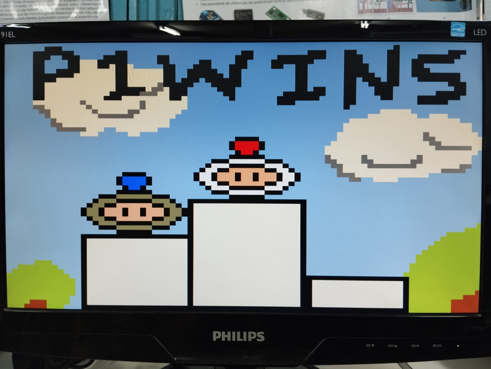
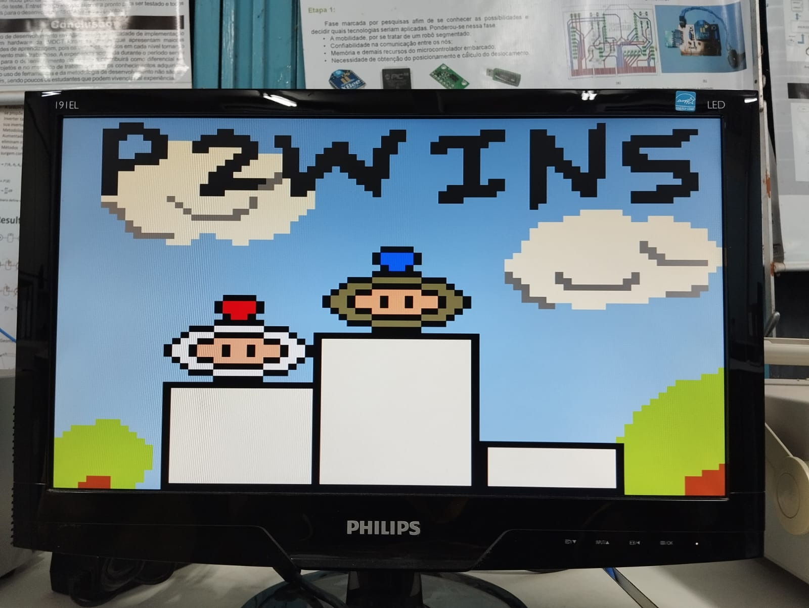

# Bomberman | Sistemas Digitais (TP01) 

  

<strong>Kit de desenvolvimento DE1-SoC</strong>

<h2>  Componentes da Equipe:  </h2>
<uL> 
  <li><a href="https://github.com/Silva-Alisson">Alisson Silva</a></li>
  <li><a href="https://github.com/DaviOSC">Davi Oliveira</a></li>
  <li><a href="https://github.com/kauaQuintella">Kauã Quintella</a></li>
  <li><a href="https://github.com/Viktor-401">Sinval Victor</a></li>
</ul>

 

## Introdução

Este relatório técnico apresenta o desenvolvimento de um jogo usando biblioteca em Assembly para uma GPU do VGA e a biblioteca do acelerômetro ADXL345 na plataforma de desenvolvimento DE1-SoC com arquitetura ARMv7A. Estas bibliotecas foram ultilizada para rodar o jogo em estilo Bomberman. E para isso, foi necessário a aplicação prática dos conceitos de threads, programação em C e Assembly. Ao decorrer da leitura, é descrito o código do jogo, incluindo a explicação dos métodos.

## Fundamentação Teórica

### Kit de desenvolvimento DE1-SoC

A placa que foi usada para executar o jogo possue uma arquitetura baseada na *Altera System-on-Chip* (SoC) FPGA, que combina um Cortex-A9 dual core com cores embarcados com lógica programável. Nela vem integrado o *HPS* (*Hard Processor System*) baseado em ARM, consistindo no processador, periféricos como o acelerômetro (ADLX456) ultilizado e a interface de memória. O sistema do Hard Processor vem ligado perfeitamente à estrutura da FPGA usando um backbone interconectado de alta-bandalarga. (DE1-SoC Manual, 2019)

Ademais, o DE1-SoC possui as seguintes especificações gerais, de acordo com o FPGA Academy:

- Main Features:
    - Intel® Cyclone V SoC FPGA
        - 85k logic-element FPGA
        - ARM Cortex A9 MPCORE
    - 1 GB DDR, 64 MB SDRAM
    - Micro SD Card

- Basic IO:
    - 10 slide switches, 4 pushbuttons
    - 10 LEDs, six 7-segment displays

- IO Devices:
    - Audio in/out
    - VGA Video out, S-Video in
    - Ethernet, USB, Accelerometer
    - A/D converter, PS/2

  

<strong>Layout e componentes do DE1-SoC</strong>

### G-Sensor ADXL345

Esse sensor é um acelerômetro de 3 eixos, que realiza medições de alta resolução. A saída digitalizada é formatada em 16 bits com complemento de dois e pode ser acessada via interface I2C e seu endereço é 0x53.

Para a comunicação com o acelerômetro, informações obtidas no datasheet do ADXL345 e nas aulas de Arquitetura de Computadores foram de extrema importância. 

### Protocolo I2C

O I2C (*Inter-Integrated Circuit*), é um protocolo de comunicação serial síncrono, bastante utilizado na interação entre dispositivos periféricos e processadores ou microcontroladores. A comunicação ocorre utilizando dois fios: o SDA, que transporta os dados, e o SCL, responsável pelo sinal de clock que sincroniza a troca de informações. Quando aplicamos isso no G-Sensor, ele opera como um dispositivo *slave* dentro do barramento, enquanto o processador atua como *master*, controlando toda a comunicação e o envio de comandos.

Cada dispositivo conectado ao barramento I2C possui um endereço de 7 bits, o que facilita a identificação. A interação acontece quando o processador, na função de master, envia o endereço do acelerômetro e, a partir daí, realiza operações de leitura ou escrita nos registradores internos, permitindo, por exemplo, a configuração de parâmetros ou a coleta de dados do sensor.

### Linguagem C para o jogo e biblioteca do acelerômetro

O jogo foi elaborado em lingagem C por ser um requisito do problema, sendo usado o GCC para a compilação. A IDE ultilizada foi o Visual Studio Code.

### Linguagem Assembly para arquitetura ARMv7A

Para acessar a placa gráfica e usar as suas funcionalidades, foi usada a linguagem Assembly para a arquitetura da placa.

##### De acordo com o _ARM Architecture Reference Manual_:

O conjunto de instruções ARM é um conjunto de instruções de 32 bits que fornece funções abrangentes de processamento de dados e controle. 

O conjunto de instruções Thumb foi desenvolvido como um conjunto de instruções de 16 bits, com um subconjunto das funcionalidades do conjunto de instruções ARM. Ele oferece uma densidade de código significativamente melhorada, ao custo de uma pequena redução no desempenho. Um processador que executa instruções Thumb pode alternar para a execução de instruções ARM em segmentos críticos para o desempenho, especialmente para lidar com interrupções.

Perfil de Aplicação ARMv7-A:

- Implementa uma arquitetura ARM tradicional com múltiplos modos.
- Suporta uma Arquitetura de Sistema de Memória Virtual (VMSA) baseada em uma Unidade de Gerenciamento de Memória (MMU). Uma implementação ARMv7-A pode ser chamada de implementação VMSAv7.
- Suporta os conjuntos de instruções ARM e Thumb.

##### Instruções usadas para a biblioteca:

1. **`.section`, `.align`, `.ascii`, `.word`, `.zero`**: São diretivas de montagem, não instruções de máquina. Elas especificam detalhes sobre como organizar os dados e onde colocá-los na memória.

2. **`push` e `pop`**: Gerenciam a pilha. 

3. **`ldr`**: Carrega um valor na memória para um registrador.

4. **`str`**: Armazena o valor de um registrador em uma posição da memória.

5. **`mov`, `movw`, `movt`**: Movem valores para registradores.

6. **`svc` e `swi`**: Executam chamadas ao sistema (syscalls).

7. **`cmp` e `bne`/`beq`**: Comparam registradores e desviam condicionalmente.

8. **`add`, `sub`**: Realizam operações de adição e subtração entre registradores.

9. **`mul`**: Multiplicação.

10. **`lsl` e `lsr`**: Realizam deslocamentos lógicos (bit shifts).

11. **`orr` e `and`**: Realizam operações de OR e AND bit-a-bit.

12. **`bx lr`**: Retorna de uma função, usando o registrador de link (`lr`). 

Cada instrução desempenha um papel importante, desde configurar chamadas ao sistema para manipulação de memória até operações específicas de bits, necessários para o controle de hardware ou configuração de cores no sistema.

### Arquitetura Baseada em Sprites para criação de Jogos 2D

  

<strong>Representação da Arquitetura.</strong>

A arquitetura desenvolvida para o projeto é baseada em sprites e voltada para criação de jogos 2D em FPGAs, aproveitando o padrão VGA para exibir gráficos. A estrutura é composta por um processador principal (Nios II) para executar a lógica do jogo em C, e um processador gráfico responsável pela renderização dos sprites e elementos visuais. O sistema inclui memórias dedicadas para armazenamento dos sprites e do background, permitindo atualização rápida e eficiente dos gráficos. Um co-processador em estrutura pipeline auxilia na criação de polígonos (como quadrados e triângulos) e na análise de colisão entre elementos da tela, operando de forma paralela e em tempo real. Essa arquitetura modular permite que jogos sejam desenvolvidos e controlados por meio de uma API, abstraindo detalhes de baixo nível e facilitando a interação com os elementos gráficos.

### Monitor VGA

O monitor empregado no projeto foi o DELL M782p, um modelo CRT que utiliza um tubo de raios catódicos para gerar imagens. Com uma tela de 17 polegadas e resolução máxima de 1280x1024 pixels, ele possui uma interface VGA para conexão com o computador ou uma placa de desenvolvimento. Monitores CRT são conhecidos por sua reprodução de cores intensas e rápida resposta, sendo uma escolha apropriada para projetos que necessitam de interação em tempo real, como jogos e simulações.

### "Bomberman"

  

<strong>Logo do jogo original.</strong>

Segundo a Wikipédia, Bomberman é uma série de jogos de estratégia criada pela Hudson Soft. O objetivo é completar as fases usando bombas de forma estratégica para destruir obstáculos e inimigos. No projeto, o jogo inspirado foi feito obedecendo estas funcionalidades:

1. O jogador pode por uma bomba para eliminar seu inimigo ou para quebrar paredes;
2. A bomba tem um tempo para explodir, quando finalizado, ela pode detonar outras bombas, destruir paredes quebráveis e causar danos aos jogadores.
3. A bomba é posicionada na frente do player.
4. O movimento do player não é continuo.

## Descrição de alto nível

### Explicação da <a href="https://github.com/Viktor-401/DE1-SoC-Bomberman/blob/master/DE1-SoC-Bomberman-master/C/main.c">main.c</a>

O projeto **Bomberman** é uma adaptação simplificada e personalizada do clássico jogo, com diferenças notáveis em sua mecânica e estrutura de código. Aqui está uma visão geral de alto nível de como o jogo foi implementado com base nas informações fornecidas:

#### Estrutura Geral

A base do jogo é composta por um mapa dividido em células, representado por uma matriz 15x15. Cada célula pode conter diferentes tipos de objetos como blocos, jogadores e bombas. O jogo é processado em ciclos contínuos, onde cada célula do mapa é atualizada, permitindo interações dinâmicas e em tempo real. Aqui vai um resumo simplificado do que acontece para melhor entendimento (o nome das funções não são condizentes com o código nessa etapa)

#### Componentes Principais

##### **Mapa**
O mapa é representado por uma matriz de células (`Celula`), onde cada célula possui um tipo e um ponteiro para uma estrutura específica:
- **NADA**: Células vazias.
- **BLOCO**: Obstáculos com vida que podem ser destruídos (ou não, no caso de blocos indestrutíveis).
- **PLAYER**: Representam os jogadores no jogo, com atributos como vida, bombas disponíveis, velocidade, entre outros.
- **BOMBA**: Objetos colocados pelos jogadores que explodem após um determinado tempo.
- **ITEM**: Melhorias coletáveis que aumentam atributos como raio de explosão, número de bombas, vida, ou velocidade.

##### **Estruturas**
Cada elemento do jogo é representado por uma estrutura específica:
- **Bloco**: Elementos destrutíveis ou indestrutíveis do cenário.
- **Player**: Contém atributos para controlar a jogabilidade, como vida, bombas, raio de explosão, velocidade e aparência.
- **Bomba**: Define o comportamento das explosões, com tempo e raio de efeito.
- **Item**: Itens que concedem bônus ao jogador, como mais vida, velocidade ou bombas.

#### Principais Funções

##### **Interações Fundamentais**

- **mover_jogador()**: Controla o movimento dos jogadores, verificando colisões com outros objetos.
- **checar_colisao()**: Verifica se há obstruções ou itens no caminho do jogador.
- **explodir()**: Garante que as bombas causem dano aos objetos dentro do raio de explosão quando o tempo se esgota.
- **dano()**: Aplica dano a objetos, ajustando suas vidas ou marcando-os como destruídos.
- **morto()**: Remove objetos do jogo quando sua vida atinge zero.

##### **Atualização do Jogo**
- **atualizar_celula()**: Determina as ações necessárias com base no tipo de objeto presente em uma célula (mover jogadores, explodir bombas, etc.).
- **varrer_matriz()**: Atualiza todas as células do mapa e verifica o estado do jogo, retornando se ele continua ou se algum jogador venceu.

##### **Gerenciamento do Mapa**
- **gerar_mapa()**: Inicializa o cenário do jogo, posicionando blocos destrutíveis e, opcionalmente, itens.

#### **Fluxo do Jogo**
1. **Menu Inicial**: O jogador inicia o jogo a partir de uma tela de menu.

  

<strong>Menu inicial com a logo do jogo.</strong>

2. **Ciclo de Jogo**:
   - A matriz do mapa é varrida e atualizada.
   - O estado do jogo é verificado.
   - A tela é atualizada para refletir as mudanças.
   - Um pequeno atraso é aplicado antes de repetir o ciclo.

  

<strong>Jogo funcionando.</strong>

3. **Condição de Vitória**:
   - O jogo termina quando apenas um jogador permanece vivo, determinando o vencedor.

  

<strong>Jogador 1 ganhando o jogo.</strong>

### Como as Threads Funcionariam no Fluxo do Jogo
#### Inicialização

No projeto, a estrutura inicial do programa foi projetada para distribuir as tarefas principais entre diferentes threads, otimizando a organização e a execução simultânea das funcionalidades. Foram criadas quatro threads principais, com responsabilidades bem definidas:

1. **Thread Principal (Main)**: Responsável pelo controle geral do jogo, incluindo a inicialização dos componentes, a coordenação entre as demais threads e a gestão do loop principal de execução.

2. **Thread para o Controle do Mouse**: Dedicada à captura e processamento dos movimentos do mouse, permitindo sua integração como uma entrada do jogador no sistema. Essa thread monitora e interpreta os eventos do dispositivo para atualizar o estado do jogo em tempo real.

3. **Thread para o Acelerômetro**: Focada no gerenciamento dos dados do acelerômetro da placa DE1-SoC, realizando a leitura, o processamento e a calibração dos valores capturados. Essa funcionalidade foi crucial para mapear o movimento da placa às ações dentro do jogo.

4. **Thread para os Botões da Placa**: Encarga de monitorar os estados dos botões disponíveis na DE1-SoC, reconhecendo pressões e liberações em tempo real. Essa thread gerencia as entradas físicas adicionais, sincronizando as ações dos jogadores com as mecânicas do jogo.

Essa arquitetura permitiu a execução eficiente das tarefas, com cada thread operando de forma independente, mas sincronizada, garantindo a interação fluida entre o jogador e o sistema.
#### Interação Contínua

O jogador insere comandos (através de eventos de input na thread de entrada).
A thread de atualização processa os comandos e atualiza as células da matriz.
Bombas que são ativadas têm sua thread própria, que monitora o temporizador e aciona a explosão na hora certa.
#### Renderização em Paralelo

Enquanto as lógicas do jogo estão sendo processadas, a thread de renderização continua desenhando o estado atualizado na tela.

### Explicação detalhada das funções da <a href="https://github.com/Viktor-401/DE1-SoC-Bomberman/blob/master/DE1-SoC-Bomberman-master/C/main.c">main.c</a>

#### **Funções no Jogo**
---
##### `void *thread_jogo()`
**Descrição**: Thread principal do jogo, responsável pela lógica de execução, setup inicial, exibição de sprites e estados do jogo.  
**Uso**: Executa a lógica principal do jogo em loop até que `exitGame` seja alterado.  
**Parâmetros**: Nenhum.  
**Retorno**: Ponteiro `void*`.  

##### `Map *generateMap(int layout[MAP_SIZE][MAP_SIZE])`
**Descrição**: Gera o mapa do jogo com base em um layout pré-definido.  
**Uso**: Configuração inicial do mapa.  
**Parâmetros**:
- `layout`: Matriz representando o layout do mapa.  
**Retorno**: Ponteiro para o mapa gerado.  

##### `void verifyDamagePlayer(Player *player, int x, int y)`
**Descrição**: Reduz a vida do jogador se a posição `(x, y)` coincidir com a posição do jogador.  
**Uso**: Utilizada em casos de explosão para verificar danos ao jogador.  
**Parâmetros**:
- `player`: Ponteiro para o jogador.
- `x`, `y`: Coordenadas do dano.  
**Retorno**: Nenhum.  

##### `bool explode(Player *player1, Player *player2, Bomb *bomb, Map *map)`
**Descrição**: Executa a lógica de explosão de uma bomba, verificando danos ao mapa e aos jogadores.  
**Uso**: Chamada quando o timer de uma bomba chega a zero.  
**Parâmetros**:
- `player1`, `player2`: Ponteiros para os jogadores.
- `bomb`: Ponteiro para a bomba.
- `map`: Ponteiro para o mapa.  
**Retorno**: `true` se a explosão ocorreu com sucesso, `false` caso contrário.  

##### `bool takeDamage(Cell *cell, Player *player1, Player *player2, Map *map)`
**Descrição**: Aplica dano a um elemento do mapa com base em seu tipo (bloco, barreira ou bomba).  
**Uso**: Utilizada durante a explosão de bombas.  
**Parâmetros**:
- `cell`: Ponteiro para a célula do mapa.
- `player1`, `player2`: Ponteiros para os jogadores.
- `map`: Ponteiro para o mapa.  
**Retorno**: `true` se a célula bloqueou a explosão, `false` caso contrário.  

##### `bool movePlayer(Map map, Player *player, int direction)`
**Descrição**: Move um jogador em uma direção, se possível.  
**Uso**: Chamado para manipular movimentos dos jogadores.  
**Parâmetros**:
- `map`: Estrutura do mapa.
- `player`: Ponteiro para o jogador.
- `direction`: Direção do movimento (ex.: `LEFT`, `RIGHT`).  
**Retorno**: `true` se o movimento foi realizado, `false` caso contrário.  

##### `bool placeBomb(Player *player, Map *map)`
**Descrição**: Posiciona uma bomba no mapa, se o jogador possuir bombas disponíveis.  
**Uso**: Chamado quando um jogador tenta colocar uma bomba.  
**Parâmetros**:
- `player`: Ponteiro para o jogador.
- `map`: Ponteiro para o mapa.  
**Retorno**: `true` se a bomba foi posicionada com sucesso, `false` caso contrário.  

##### `int updateGame(Map *map, Player *player1, Player *player2)`
**Descrição**: Atualiza o estado do jogo, verificando explosões e a condição de vitória.  
**Uso**: Chamado a cada iteração do loop principal do jogo.  
**Parâmetros**:
- `map`: Ponteiro para o mapa.
- `player1`, `player2`: Ponteiros para os jogadores.  
**Retorno**: Estado atual do jogo (`P1WINS`, `P2WINS`, `DRAW`, `ONGOING`).  

##### `Map *GameSetup(Map *map, Player *player1, Player *player2)`

**Descrição**: Configura o estado inicial do jogo, incluindo o mapa e os jogadores.  
**Parâmetros:**
- `map`: Ponteiro para a estrutura do mapa.  
- `player1`: Ponteiro para o primeiro jogador.  
- `player2`: Ponteiro para o segundo jogador.  
**Retorno**: Ponteiro para a estrutura `Map` inicializada.  

##### `void Movement(int *cooldownMovement, Player *player1, Player *player2, Map map)`

**Descrição**: Controla o movimento dos jogadores no mapa.  
**Parâmetros:**  
- `cooldownMovement`: Controle para o tempo entre movimentos.  
- `player1`: Ponteiro para o primeiro jogador.  
- `player2`: Ponteiro para o segundo jogador.  
- `map`: Estrutura do mapa atual.  
**Retorno:** Nenhum.  

##### `void InGameActions(Mouse *mouse, Player *player1, Player *player2, Map *map)`

**Descrição**: Processa as ações dentro do jogo, como posicionamento de bombas.  
**Parâmetros:**  
- `mouse`: Ponteiro para a estrutura do mouse.  
- `player1`: Ponteiro para o primeiro jogador.  
- `player2`: Ponteiro para o segundo jogador.  
- `map`: Ponteiro para a estrutura do mapa.  
**Retorno:** Nenhum.  

##### `void encerrarJogo()`
**Descrição**: Finaliza o jogo ao alterar a flag `exitGame` para `true` e enviar o sinal `SIGTERM`.  
**Uso**: Chamado quando o programa precisa ser encerrado.  
**Parâmetros**: Nenhum.  
**Retorno**: Nenhum.  

#### Funções auxiliares
---
##### `void ImprimirTextMatrix(int matriz[SCREEN_HEIGHT][SCREEN_WIDTH])`
**Descrição**: Imprime uma matriz de texto na tela.  
**Parâmetros**:
- `matriz`: Matriz a ser impressa.  
**Retorno**: Nenhum.  

##### `void ImprimirTabuleiro(Map *map)`
**Descrição**: Renderiza o mapa na tela.  
**Parâmetros**:
- `map`: Ponteiro para o mapa.  
**Retorno**: Nenhum.  

##### `int InitDevices(Mouse *mouse)`
**Descrição**: Inicializa dispositivos como mouse e acelerômetro.  
**Parâmetros**:
- `mouse`: Ponteiro para a estrutura do mouse.  
**Retorno**: `0` se bem-sucedido, `-1` em caso de erro.  

##### `void Delay(float segundos)`
**Descrição**: Introduz um atraso no programa.  
**Parâmetros**:
- `segundos`: Duração do atraso.  
**Retorno**: Nenhum.  

##### `int readInputsP1(int accel_x, int accel_y)`
**Descrição**: Converte os valores do acelerômetro em direções para o jogador 1.  
**Parâmetros**:
- `accel_x`, `accel_y`: Valores do acelerômetro.  
**Retorno**: Direção (ex.: `LEFT`, `RIGHT`) ou `-1` se não houver movimento.  

##### `int readInputsP2(int eixo, int valor)`
**Descrição**: Converte os valores do mouse em direções para o jogador 2.  
**Parâmetros**:
- `eixo`: Indica o eixo (X ou Y).
- `valor`: Valor do movimento no eixo.  
**Retorno**: Direção (ex.: `LEFT`, `RIGHT`) ou `-1` se não houver movimento.  

##### `Map *GameSetup(Map *map, Player *player1, Player *player2)`

**Descrição**: Configura o estado inicial do jogo, incluindo o mapa e os jogadores.
**Parâmetros:**
  - `map:` Ponteiro para a estrutura do mapa.
  - `player1:` Ponteiro para o primeiro jogador.
  - `player2:` Ponteiro para o segundo jogador.
**Retorno:** Ponteiro para a estrutura Map inicializada.
Aqui está a estrutura completa no formato solicitado, pronta para ser usada no GitHub:

##### `void ImprimirDesenhosBomberman(int x, int y, int matriz[27][20])`

**Descrição**: Renderiza desenhos específicos do jogo na tela.  
**Parâmetros:**  
- `x`: Coordenada horizontal para renderização.  
- `y`: Coordenada vertical para renderização.  
- `matriz`: Matriz 27x20 representando o conteúdo a ser renderizado.  
**Retorno:** Nenhum.  

##### `void GameMenu()`

**Descrição**: Exibe o menu inicial do jogo e aguarda a entrada do jogador para iniciar.  
**Parâmetros:** Nenhum.  
**Retorno:** Nenhum.  

##### `void Imprimircoisas2x(int x, int y, int matriz[20][20])`

**Descrição**: Renderiza uma matriz 20x20 em uma posição específica da tela.  
**Parâmetros:**  
- `x`: Coordenada horizontal para a renderização.  
- `y`: Coordenada vertical para a renderização.  
- `matriz`: Matriz 20x20 representando o conteúdo a ser renderizado.  
**Retorno:** Nenhum.  

##### `int GetMouseEvent(int mouse, struct input_event *ev)`

**Descrição**: Lê eventos do mouse.  
**Parâmetros:**  
- `mouse`: Identificador do dispositivo de entrada do mouse.  
- `ev`: Ponteiro para a estrutura `input_event` para armazenar os eventos lidos.  
**Retorno:** Retorna `0` após ler o evento.  

##### `void ProgramActions(bool *exitGame)`

**Descrição**: Gerencia ações globais do programa, como pausa ou encerramento do jogo.  
**Parâmetros:**  
- `exitGame`: Ponteiro para o indicador de saída do jogo.  
**Retorno:** Nenhum.  

##### `void *readMouse()`

**Descrição**: Lê continuamente os movimentos e eventos do mouse, atualizando as ações do jogador 2.  
**Parâmetros:** Nenhum.  
**Retorno:** Nenhum.  

##### `void *readAccell()`

**Descrição**: Lê os valores do acelerômetro para determinar os movimentos do jogador 1.  
**Parâmetros:** Nenhum.  
**Retorno:** Nenhum.  

##### `void *readKeys()`

**Descrição**: Lê continuamente as teclas pressionadas para controle do jogo.  
**Parâmetros:** Nenhum.  
**Retorno:** Nenhum.  

### Fluxo do jogo no menu
- **Menu principal**:
  - O jogador pode iniciar o jogo.
  - Durante o jogo:
    - **Atualizações**: Chamadas constantes de `varrer_matriz` e `mostrar_tela`.
    - **Delay**: Insere pausas entre ciclos de atualização para sincronizar as ações.
    - **Verificação de estado**: Determina se o jogo continua ou termina.

### Como executar o projeto?

Após baixar os arquivos da pasta `source`, basta executar o arquivo makefile usando `make main` no terminal.

      #make main
      main:
        gcc -o main -pthread gpu_lib.s accel_lib.c main.c 
        ./main

### Telas

  

<strong>Vitória do Player 1.</strong>

  

<strong>Vítoria do Player 2.</strong>

  

<strong>Empate entre os jogadores.</strong>

  

<strong>Main screen do jogo.</strong>

## Conclusão 

O projeto Bomberman na DE1-SoC utilizou uma arquitetura baseada em threads, onde a thread principal (main) gerenciava o loop do jogo e coordenava outras threads dedicadas, como a do mouse, que captava movimentos do jogador; a do acelerômetro, que processava dados do sensor ADXL345 para controle adicional; e a dos botões, que monitorava ações físicas como movimentação e colocação de bombas.

A lógica do jogo foi implementada em C, enquanto o controle do hardware gráfico e periféricos foi feito em Assembly, utilizando instruções específicas da arquitetura ARMv7A para otimizar a movimentação de sprites e a detecção de colisões. O acelerômetro ADXL345 foi integrado via protocolo I2C, permitindo uma interação inovadora com dados de movimento em três eixos.

A renderização gráfica foi realizada por sprites e background block, o que facilitou a criação de elementos visuais, como jogadores, blocos, bombas e explosões. A matriz 15x15 que representava o mapa gerenciava o estado de cada célula, garantindo interações consistentes dentro da mecânica tradicional do Bomberman, como a colocação de bombas, destruição de blocos e confronto entre jogadores.

## Bibliografia

Using the Accelerometer on DE-Series Boards. Disponível em: https://github.com/fpgacademy/Tutorials/releases/download/v21.1/Accelerometer.pdf. Acessado em: 23 de setembro de 2024.

TERASIC. DE1-SoC User-Manual. Disponível em: https://drive.google.com/file/d/1HzYtd1LwzVC8eDobg0ZXE0eLhyUrIYYE/view. Acessado em: 26 de setembro de 2024.

FPGA Academy. Disponível em: https://fpgacademy.org/. Acessado em: 26 de setembro de 2024.

SOUZA, Fábio. Comunicação I2C. Postado em: 03 de janeiro de 2023. Disponível em: https://embarcados.com.br/comunicacao-i2c/. Acessado em: 26 de setembro de 2024.

PATTERSON, David A.; HENNESSY, John L. Computer Organization and Design: The Hardware Software Interface, ARM Edition. 2016. Morgan Kaufmann. ISBN: 978-0-12-801733-3.

ARM. ARM Architecture Reference Manual ARMv7-A and ARMv7-R edition. Disponível em: https://developer.arm.com/documentation/ddi0406/latest. 

https://pt.wikipedia.org/wiki/Bomberman
