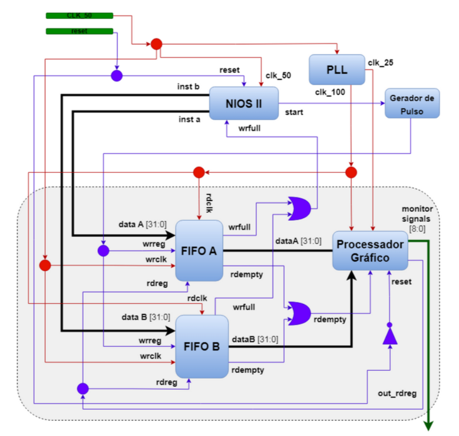

# ASM-GPU-lib | Sistemas Digitais (TP01) 

  

<strong>Kit de desenvolvimento DE1-SoC</strong>

<h2>  Componentes da Equipe:  </h2>
<uL> 
  <li><a href="https://github.com/Silva-Alisson">Alisson Silva</a></li>
  <li><a href="https://github.com/DaviOSC">Davi Oliveira</a></li>
  <li><a href="https://github.com/kauaQuintella">Kauã Quintella</a></li>
  <li><a href="https://github.com/Viktor-401">Sinval Victor</a></li>
</ul>

 

## Introdução

Este relatório técnico apresenta o desenvolvimento de um jogo usando biblioteca em Assembly para uma GPU do VGA e a biblioteca do acelerômetro ADXL345 na plataforma de desenvolvimento DE1-SoC com arquitetura ARMv7A. Estas s será ultilizada para rodar o jogo em estilo Bomberman. E para isso, foi necessário a aplicação prática dos conceitos de threads, programação em C e Assembly. Ao decorrer da leitura, é descrito o código do jogo, incluindo a explicação dos métodos.

## Fundamentação Teórica

### Kit de desenvolvimento DE1-SoC

A placa que foi usada para executar o jogo possue uma arquitetura baseada na *Altera System-on-Chip* (SoC) FPGA, que combina um Cortex-A9 dual core com cores embarcados com lógica programável. Nela vem integrado o *HPS* (*Hard Processor System*) baseado em ARM, consistindo no processador, periféricos como o acelerômetro (ADLX456) ultilizado e a interface de memória. O sistema do Hard Processor vem ligado perfeitamente à estrutura da FPGA usando um backbone interconectado de alta-bandalarga. (DE1-SoC Manual, 2019)

Ademais, o DE1-SoC possui as seguintes especificações gerais, de acordo com o FPGA Academy:

- Main Features:
    - Intel® Cyclone V SoC FPGA
        - 85k logic-element FPGA
        - ARM Cortex A9 MPCORE
    - 1 GB DDR, 64 MB SDRAM
    - Micro SD Card

- Basic IO:
    - 10 slide switches, 4 pushbuttons
    - 10 LEDs, six 7-segment displays

- IO Devices:
    - Audio in/out
    - VGA Video out, S-Video in
    - Ethernet, USB, Accelerometer
    - A/D converter, PS/2

  

<strong>Layout e componentes do DE1-SoC</strong>

### G-Sensor ADXL345

Esse sensor é um acelerômetro de 3 eixos, que realiza medições de alta resolução. A saída digitalizada é formatada em 16 bits com complemento de dois e pode ser acessada via interface I2C e seu endereço é 0x53.

Para a comunicação com o acelerômetro, informações obtidas no datasheet do ADXL345 e nas aulas de Arquitetura de Computadores foram de extrema importância. 

### Protocolo I2C

O I2C (*Inter-Integrated Circuit*), é um protocolo de comunicação serial síncrono, bastante utilizado na interação entre dispositivos periféricos e processadores ou microcontroladores. A comunicação ocorre utilizando dois fios: o SDA, que transporta os dados, e o SCL, responsável pelo sinal de clock que sincroniza a troca de informações. Quando aplicamos isso no G-Sensor, ele opera como um dispositivo *slave* dentro do barramento, enquanto o processador atua como *master*, controlando toda a comunicação e o envio de comandos.

Cada dispositivo conectado ao barramento I2C possui um endereço de 7 bits, o que facilita a identificação. A interação acontece quando o processador, na função de master, envia o endereço do acelerômetro e, a partir daí, realiza operações de leitura ou escrita nos registradores internos, permitindo, por exemplo, a configuração de parâmetros ou a coleta de dados do sensor.

### Linguagem C para o Tetris e biblioteca do acelerômetro

O jogo foi elaborado em lingagem C por ser um requisito do problema, sendo usado o GCC para a compilação. A IDE ultilizada foi o Visual Studio Code.

### Linguagem Assembly para arquitetura ARMv7A

Para acessar a placa gráfica e usar as suas funcionalidades, foi usada a linguagem Assembly para a arquitetura da placa.

##### De acordo com o _ARM Architecture Reference Manual_:

O conjunto de instruções ARM é um conjunto de instruções de 32 bits que fornece funções abrangentes de processamento de dados e controle. 

O conjunto de instruções Thumb foi desenvolvido como um conjunto de instruções de 16 bits, com um subconjunto das funcionalidades do conjunto de instruções ARM. Ele oferece uma densidade de código significativamente melhorada, ao custo de uma pequena redução no desempenho. Um processador que executa instruções Thumb pode alternar para a execução de instruções ARM em segmentos críticos para o desempenho, especialmente para lidar com interrupções.

Perfil de Aplicação ARMv7-A:

- Implementa uma arquitetura ARM tradicional com múltiplos modos.
- Suporta uma Arquitetura de Sistema de Memória Virtual (VMSA) baseada em uma Unidade de Gerenciamento de Memória (MMU). Uma implementação ARMv7-A pode ser chamada de implementação VMSAv7.
- Suporta os conjuntos de instruções ARM e Thumb.

##### Instruções usadas para a biblioteca:

1. **`.section`, `.align`, `.ascii`, `.word`, `.zero`**: São diretivas de montagem, não instruções de máquina. Elas especificam detalhes sobre como organizar os dados e onde colocá-los na memória.

2. **`push` e `pop`**: Gerenciam a pilha. 

3. **`ldr`**: Carrega um valor na memória para um registrador.

4. **`str`**: Armazena o valor de um registrador em uma posição da memória.

5. **`mov`, `movw`, `movt`**: Movem valores para registradores.

6. **`svc` e `swi`**: Executam chamadas ao sistema (syscalls).

7. **`cmp` e `bne`/`beq`**: Comparam registradores e desviam condicionalmente.

8. **`add`, `sub`**: Realizam operações de adição e subtração entre registradores.

9. **`mul`**: Multiplicação.

10. **`lsl` e `lsr`**: Realizam deslocamentos lógicos (bit shifts).

11. **`orr` e `and`**: Realizam operações de OR e AND bit-a-bit.

12. **`bx lr`**: Retorna de uma função, usando o registrador de link (`lr`). 

Cada instrução desempenha um papel importante, desde configurar chamadas ao sistema para manipulação de memória até operações específicas de bits, necessários para o controle de hardware ou configuração de cores no sistema.

### Arquitetura Baseada em Sprites para criação de Jogos 2D

  

<strong>Representação da Arquitetura.</strong>

A arquitetura desenvolvida para o projeto é baseada em sprites e voltada para criação de jogos 2D em FPGAs, aproveitando o padrão VGA para exibir gráficos. A estrutura é composta por um processador principal (Nios II) para executar a lógica do jogo em C, e um processador gráfico responsável pela renderização dos sprites e elementos visuais. O sistema inclui memórias dedicadas para armazenamento dos sprites e do background, permitindo atualização rápida e eficiente dos gráficos. Um co-processador em estrutura pipeline auxilia na criação de polígonos (como quadrados e triângulos) e na análise de colisão entre elementos da tela, operando de forma paralela e em tempo real. Essa arquitetura modular permite que jogos sejam desenvolvidos e controlados por meio de uma API, abstraindo detalhes de baixo nível e facilitando a interação com os elementos gráficos.

### Monitor VGA

O monitor empregado no projeto foi o DELL M782p, um modelo CRT que utiliza um tubo de raios catódicos para gerar imagens. Com uma tela de 17 polegadas e resolução máxima de 1280x1024 pixels, ele possui uma interface VGA para conexão com o computador ou uma placa de desenvolvimento. Monitores CRT são conhecidos por sua reprodução de cores intensas e rápida resposta, sendo uma escolha apropriada para projetos que necessitam de interação em tempo real, como jogos e simulações.

### "Bomberman"

  

<strong>Logo do jogo original.</strong>

Segundo a Wikipédia, Bomberman é uma série de jogos de estratégia criada pela Hudson Soft. O objetivo é completar as fases usando bombas de forma estratégica para destruir obstáculos e inimigos. No projeto, o jogo inspirado foi feito obedecendo estas funcionalidades:

1. O jogador pode por uma bomba para eliminar seu inimigo ou para quebrar paredes;
2. A bomba tem um tempo para explodir, quando finalizado, ela pode detonar outras bombas, destruir paredes quebráveis e causar danos aos jogadores.

## Descrição de alto nível

### Explicação da <a href="https://github.com/DaviOSC/DE1-Soc-ASM-GPU-lib/blob/main/Complete/gpu_lib.s">gpu_lib.s</a>

A arquitetura implementada por Gabriel B. Alves para jogos 2D conta com funcionalidades específicas para exibir informações via VGA. Para usa-las, um mapeamento de memória é necessário para enviar as instruções almejadas. Dessa forma, o programa em Assembly irá conseguir ter uma comunicação direta com o periférico em questão. Esse processo é realizado através dessas funções:

    int create_mapping_memory();

    int close_mapping_memory();

Feito esse processo, as instruções são enviadas por duas vias de dado, um relacionado ao `dataA` e outra ao `dataB`. De acordo com o TCC:

-  _**dataA**_: opcodes e endereçamento do Banco de Registrador e Memórias;
- _**dataB**_: envio de dados a serem armazenados e/ou atualizados;

Seguindo essa lógica, foi criado o método `send_instruction`, que é responsável por essa tarefa.

Como mencionado anteriormente, a arquitetura permite funcionalidades específicas para jogos 2D, tanto que foi descrita algumas delas no código em C, sendo elas:

    int set_sprite (int registrador, int x, int y, int offset, int activation_bit);

    int set_background_block (int column, int line, int R, int G, int B);

    int set_background_color (int R, int G, int B);
  

As funções set vão colocar ou alterar um elemento na tela, seja inserir um sprite ou mudar uma cor. No projeto, a função set_background_block foi a mais importante para exibir as informações na tela de acordo com os valores de uma matriz

Além dessas, foram inseridas funções auxiliares para a resolução do problema:

    background_box (int x, int y, int width, int height, int color);

    set_sprite_memory (int sprite_slot, int color, int x, int y);

    clear_sprite (int id);

    set_polygon (int id, int color, int shape, int size, int x, int y);

    clear_polygon(int id);

    clear_background();

    clear_all();

    read_keys();

A função `background_box()` desenha um retângulo com largura e altura específicas através de um laço para preencher o retângulo. Já a `set_sprite_memory` altera o sprite presente na memória por um outro definido pelo usuário. A `clear_sprite` vai limpar um sprite específico da tela ou todos. `set_polygon` é responsável por imprimir um dos dois polígonos na tela (quadrado ou triângulo), enquanto o `clear_polygon` remove um ou todos. A função `clear_background()` limpa o fundo, aplicando uma cor transparente em toda a área e a `clear_all()` faz a limpeza completa da tela. E por fim, a função `read_keys()` faz a leitura do estado dos botões de entrada.

### Explicação detalhada das funções da <a href="https://github.com/DaviOSC/DE1-Soc-ASM-GPU-lib/blob/main/Complete/gpu_lib.s">gpu_lib.s</a>

#### `create_mapping_memory() : int`
- **Propósito**: Mapeia a memória do dispositivo `/dev/mem` para acesso direto.
- **Implementação**:
  - Abre o dispositivo com a syscall `open` e obtém o file descriptor.
  - A função `mmap2` é chamada para mapear a memória no espaço de endereçamento do processo, com o resultado armazenado no ponteiro `pDevMem`.
  - Os parâmetros `PROT_READ` e `PROT_WRITE` são usados para configurar permissões de leitura e escrita na memória mapeada.
- **Assembly**: Registros como `r0` e `r1` carregam parâmetros da syscall; o resultado da `mmap2` é salvo em `pDevMem`.

#### `close_mapping_memory() : void`
- **Propósito**: Desfaz o mapeamento de memória e fecha o file descriptor.
- **Implementação**:
  - Chama `munmap` para liberar o mapeamento, passando `pDevMem` e o tamanho da memória mapeada.
  - Em seguida, usa `close` para encerrar o file descriptor.
- **Assembly**: Registros `r0` e `r1` carregam o endereço e o tamanho para `munmap`; `r0` armazena o fd antes de chamar `close`.

#### `send_instruction(unsigned int dataA, unsigned int dataB) : void`
- **Propósito**: Envia instruções compostas para o periférico.
- **Implementação**:
  - Primeiro, verifica o estado do periférico ao ler um endereço específico em `pDevMem`.
  - Em seguida, armazena `dataA` e `dataB` nos registros correspondentes para iniciar a operação.
- **Assembly**: `ldr` carrega dados de `pDevMem`; `mov` e `str` configuram `dataA` e `dataB`.

#### `set_background_color(unsigned long vermelho, unsigned long verde, unsigned long azul) : void`
- **Propósito**: Define a cor de fundo combinando valores RGB.
- **Implementação**:
  - Calcula `dataB` com deslocamentos e combinações lógicas para integrar os valores RGB.
  - `dataA` é definido como `0`, e `send_instruction` é chamado para enviar a instrução.
- **Assembly**: Usa `lsl` para deslocar bits e `orr` para combinar os valores RGB em `dataB`.

#### `set_background_block(unsigned long linha, unsigned long coluna, unsigned long vermelho, unsigned long verde, unsigned long azul) : void`
- **Propósito**: Define a cor de um bloco de fundo em uma posição específica.
- **Implementação**:
  - Calcula o endereço com base em `linha` e `coluna`, e combina os valores RGB em `dataB`.
  - Envia `dataA` e `dataB` via `send_instruction`.
- **Assembly**: Usa instruções `mul` para calcular a posição e `orr` para combinar valores RGB.

#### `background_box(unsigned long x, unsigned long y, unsigned long largura, unsigned long altura, unsigned long cor) : void`
- **Propósito**: Desenha um retângulo colorido no fundo.
- **Implementação**:
  - Utiliza laços para preencher o retângulo, calculando os limites usando `x`, `y`, `largura` e `altura`.
  - `dataA` e `dataB` são configurados para cada posição do bloco no retângulo.
- **Assembly**: Laços `loop` para `x` e `y`; `mov` e `str` atualizam a posição e cor para cada pixel.

#### `set_sprite_memory(unsigned long sprite_slot, unsigned long cor, unsigned long x, unsigned long y) : void`
- **Propósito**: Configura um pixel específico em um sprite.
- **Implementação**:
  - Calcula o endereço de memória do pixel com base em `sprite_slot`, `x`, e `y`.
  - Configura `dataA` e `dataB` com a posição e cor.
- **Assembly**: Instruções `mul` para cálculo de posição; `mov` e `orr` definem a cor.

#### `set_sprite(unsigned long id, unsigned long sprite_image, unsigned long ativado, unsigned long x, unsigned long y) : void`
- **Propósito**: Configura um sprite com posição e imagem.
- **Implementação**:
  - Define `dataA` com coordenadas e `dataB` com o identificador da imagem.
  - `send_instruction` aplica as configurações.
- **Assembly**: `mov` e `orr` para configurar posição e imagem.

#### `clear_sprite(unsigned long id) : void`
- **Propósito**: Desativa um sprite específico ou todos os sprites.
- **Implementação**:
  - Define `dataA` e `dataB` com valores apropriados para desativar o sprite ou todos.
- **Assembly**: Usa `cmp` para verificar se `id` é `-1`; caso positivo, limpa todos os sprites.

#### `set_polygon(unsigned long id, unsigned long cor, unsigned long forma, unsigned long tamanho, unsigned long x, unsigned long y) : void`
- **Propósito**: Configura um polígono com propriedades específicas.
- **Implementação**:
  - Usa `dataA` e `dataB` para representar forma, tamanho, posição e cor do polígono.
  - Envia a instrução para desenhar o polígono.
- **Assembly**: `mov` e `orr` para configurar as características do polígono.

#### `clear_polygon(unsigned long id) : void`
- **Propósito**: Desativa um polígono específico ou todos os polígonos.
- **Implementação**:
  - Configura `dataA` e `dataB` para desativar o polígono com o `id` dado.
- **Assembly**: `cmp` verifica se `id` é `-1` para desativar todos os polígonos.

#### `clear_background() : void`
- **Propósito**: Limpa o fundo aplicando uma cor transparente em toda a área.
- **Implementação**:
  - Configura um retângulo de fundo com altura e largura máximas.
  - Usa `background_box` para aplicar a cor transparente em toda a área.
- **Assembly**: Calcula a altura e largura máximas; chama `background_box`.

#### `clear_all() : void`
- **Propósito**: Executa uma limpeza completa da tela.
- **Implementação**:
  - Chama `clear_background`, `clear_all_sprite` e `clear_all_polygon`.
- **Assembly**: Invoca cada função de limpeza em sequência.

#### `read_keys() : int`
- **Propósito**: Lê o estado dos botões de entrada.
- **Implementação**:
  - Carrega o estado dos botões de `pDevMem`.
  - Usa `mvn` para inverter os bits e retornar o estado dos botões.
- **Assembly**: Usa `ldr` para carregar dados e `mvn` para inversão.

### Como executar o projeto?

Após baixar os arquivos da pasta `source`, basta executar o arquivo makefile usando `make tetris` no terminal.

      #make tetris
      tetris:
        gcc -o tetrisExe main.c gpu_lib.s accel_lib.c -lintelfpgaup
        sudo ./tetrisExe

## Bibliografia

Using the Accelerometer on DE-Series Boards. Disponível em: https://github.com/fpgacademy/Tutorials/releases/download/v21.1/Accelerometer.pdf. Acessado em: 23 de setembro de 2024.

TERASIC. DE1-SoC User-Manual. Disponível em: https://drive.google.com/file/d/1HzYtd1LwzVC8eDobg0ZXE0eLhyUrIYYE/view. Acessado em: 26 de setembro de 2024.

FPGA Academy. Disponível em: https://fpgacademy.org/. Acessado em: 26 de setembro de 2024.

SOUZA, Fábio. Comunicação I2C. Postado em: 03 de janeiro de 2023. Disponível em: https://embarcados.com.br/comunicacao-i2c/. Acessado em: 26 de setembro de 2024.

PATTERSON, David A.; HENNESSY, John L. Computer Organization and Design: The Hardware Software Interface, ARM Edition. 2016. Morgan Kaufmann. ISBN: 978-0-12-801733-3.

ARM. ARM Architecture Reference Manual ARMv7-A and ARMv7-R edition. Disponível em: https://developer.arm.com/documentation/ddi0406/latest. 

https://pt.wikipedia.org/wiki/Bomberman